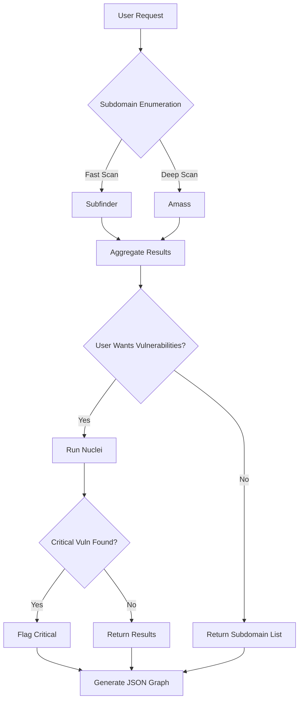
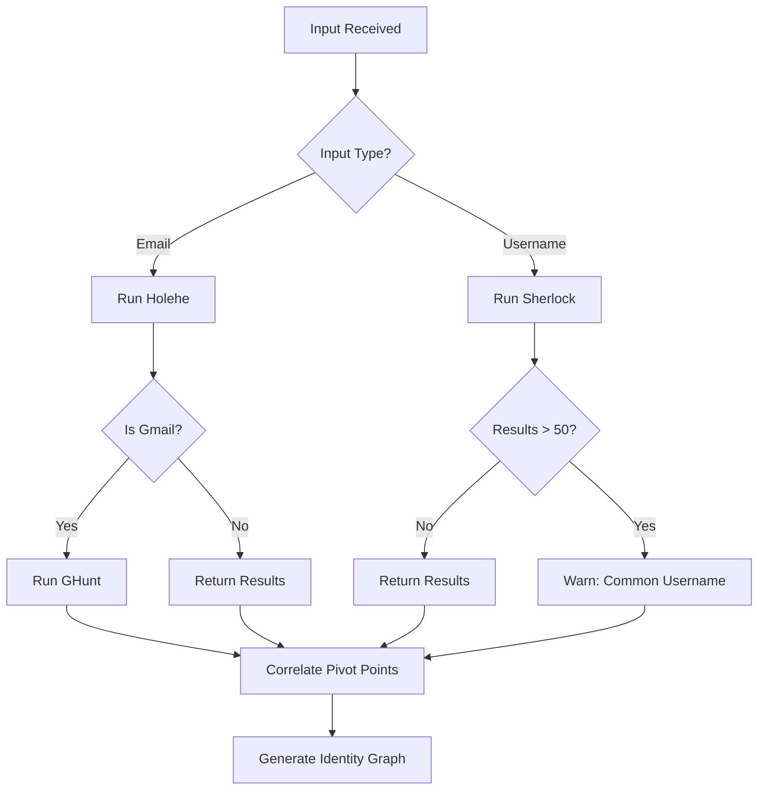
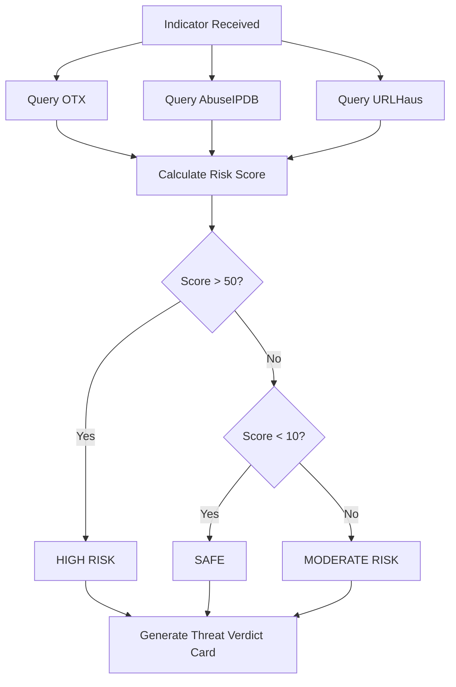
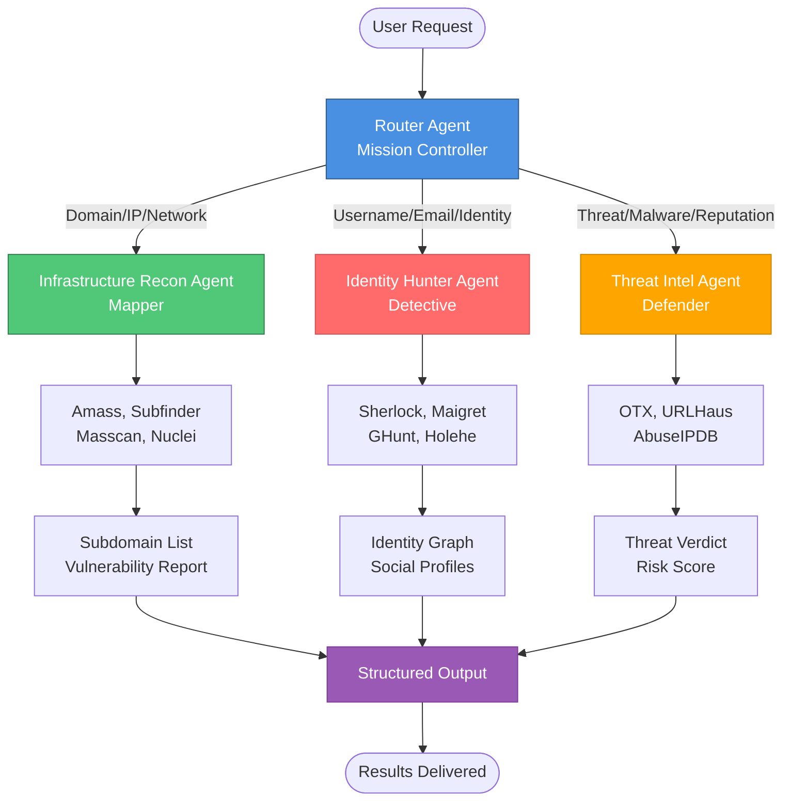

# 🎯 Top 10 OSINT Use Cases & Multi-Agent System Architecture

> **Architectural Note:** In an AI-First OSINT SaaS, you do not want one giant "do everything" prompt. You need a **Multi-Agent System** with specialized agents working together.

---

## 🚀 Bootstrapped OSINT SaaS Strategy: Self-Hosted OSS Tools

For a **bootstrapped, AI-First OSINT SaaS**, you want to shift your strategy from **"buying data" (APIs)** to **"generating data" (Self-hosted Engines)**.

You can run these **20 Open Source Software (OSS) tools** on your own infrastructure (as microservices). They are:
- ✅ **Free to use**
- ✅ **Highly effective**
- ✅ **Output JSON** (critical for your AI pipeline)

---

## 📦 Category 1: Infrastructure & Network Recon (The "Heavy Lifters")

These tools map the internet for you **without paying for Shodan/Censys**.

### OWASP Amass
- **What it does:** The gold standard for subdomain enumeration and asset mapping.
- **Integration:** `amass enum -json report.json`
- **AI Use Case:** Feed the JSON network graph into your vector DB so your AI knows "subdomain A is related to IP B".

### Project Discovery's Nuclei
- **What it does:** A template-based vulnerability scanner. It's like a free, customizable scanner for misconfigurations.
- **Integration:** Outputs JSON lines (`-jsonl`).
- **AI Use Case:** Use it to "fact check" if a target is actually vulnerable.

### Project Discovery's Subfinder
- **What it does:** Extremely fast passive subdomain discovery.
- **Integration:** Pipes perfectly into other tools via standard streams.

### Masscan
- **What it does:** The fastest Internet port scanner. It can scan the entire internet in under 6 minutes (if you have the bandwidth).
- **Integration:** Output `-oJ output.json`
- **⚠️ Warning:** This is "loud." Use it carefully or for targeted IP ranges only.

### ZMap
- **What it does:** Similar to Masscan but specialized for single-packet scanning.
- **Integration:** Outputs CSV/JSON.

### TheHarvester
- **What it does:** Gathers emails, subdomains, hosts, employee names, open ports, and banners from public search engines (Google, Bing, LinkedIn).
- **Integration:** `theHarvester -d target.com -f filename -o json`

### DNSDumpster (via API/Script)
- **What it does:** While a website, it has a free API (unofficial python wrappers exist) to get DNS mapping without scanning yourself.

---

## 👤 Category 2: Person & Identity (SOCMINT)

Tools to find people and accounts.

### Sherlock
- **What it does:** Checks for usernames across 300+ social media sites.
- **Integration:** Python script. `python3 sherlock --json username`
- **AI Use Case:** "Find me everywhere 'john.doe' exists."

### Maigret
- **What it does:** A more advanced fork of Sherlock that extracts metadata (IDs, names) from the profiles it finds, not just existence.
- **Integration:** Outputs a comprehensive HTML/PDF report and JSON.

### GHunt
- **What it does:** The ultimate Google Account investigator. Extracts name, reviews, photos, and calendar details from a Gmail address.
- **Integration:** Python module.
- **AI Use Case:** "Who owns this email?" → Returns real name and Google Maps reviews they've left.

### Holehe
- **What it does:** Checks if an email is registered on 120+ sites (Amazon, Twitter, Instagram) by abusing the "forgot password" function.
- **Integration:** Simple CLI tool. High accuracy.

---

## 📄 Category 3: Content & Dark Web

Gathering unstructured text for your AI to read.

### Scrapy (Framework)
- **What it does:** Not a "tool" but the best Python framework for building your own crawlers for specific sites (e.g., scraping news sites or forums).
- **Integration:** Native Python.

### Waybackurls (by Tomnomnom)
- **What it does:** Fetches all known URLs for a domain from the Wayback Machine.
- **Integration:** Pipe the list of URLs into your AI to find "old/forgotten" files (like `confidential.pdf` from 2018).

### OnionSearch
- **What it does:** Python script that scrapes multiple Dark Web search engines (Ahmia, Torch, etc.).
- **Integration:** Outputs results to text/JSON.

---

## 🛡️ Category 4: Threat Intelligence Feeds (The "Free Lists")

These are not tools, but raw data sources you can ingest for free.

### AlienVault OTX (Open Threat Exchange)
- **Integration:** Free API.
- **Data:** Crowd-sourced IP and Domain reputation.

### URLHaus (by Abuse.ch)
- **Integration:** Download their CSV database of malicious URLs.
- **Data:** Excellent for phishing detection.

### MISP (Malware Information Sharing Platform)
- **What it does:** A self-hosted threat intelligence platform.
- **Integration:** You host it. It comes pre-loaded with "default feeds" that are free (CIRCL, etc.).
- **AI Use Case:** Use MISP as your "Memory" for threats.

---

## 📎 Category 5: File & Metadata Analysis

### ExifTool
- **What it does:** Extracts metadata from images/PDFs (GPS coordinates, Author Name, Software version).
- **Integration:** Command line wrapper.
- **AI Use Case:** User uploads a photo → ExifTool extracts GPS → AI tells user "This was taken in Paris."

### YARA
- **What it does:** "Pattern matching swiss army knife" for malware researchers.
- **Integration:** Python library (`yara-python`).
- **Use:** Write simple rules to classify documents/files uploaded by users.

---

## 🔧 Category 6: The "All-in-One" Framework (Careful)

### SpiderFoot (Open Source Version)
- **Note:** There is a paid "HX" version and a free GitHub version.
- **Status:** The OSS version is a bit older but still works for many modules.
- **Integration:** It runs a local web server but has a CLI mode. It aggregates 50+ free OSINT sources automatically.

---

## ⚙️ Implementation Advice for SaaS

To use these in a product **without getting blocked or sued**:

### Queue System
- **Do not run these synchronously** when a user clicks a button. Use a queue (like RabbitMQ or Redis) to run Amass or Sherlock in the background, then notify the user.

### Proxies
- Tools like Sherlock and GHunt scrape sites that hate bots (Google, Instagram). You **must route their traffic through rotating residential proxies**, or your SaaS IP will be banned in minutes.

### Self-Hosting
- **Do not rely on third-party APIs** for these. Spin up a cheap VPS (or container) to run the scanners yourself.

---

## 📋 Table of Contents

1. [Self-Hosted OSS Tools Strategy](#-bootstrapped-osint-saas-strategy-self-hosted-oss-tools)
2. [Top 10 OSINT Use Cases](#part-1-top-10-osint-use-cases)
3. [Agentic Workflow Architecture](#part-2-the-agentic-workflow)
4. [Agent System Prompts](#agent-system-prompts)
5. [Workflow Visualization](#visualizing-the-workflow)

---

## 🔗 OSS Tools → Agent Mapping

| Tool | Category | Primary Agent | Use Case |
|------|----------|---------------|----------|
| **Amass** | Infrastructure | Infrastructure_Recon_Agent | Subdomain enumeration |
| **Nuclei** | Infrastructure | Infrastructure_Recon_Agent | Vulnerability scanning |
| **Subfinder** | Infrastructure | Infrastructure_Recon_Agent | Fast subdomain discovery |
| **Masscan** | Infrastructure | Infrastructure_Recon_Agent | Port scanning |
| **ZMap** | Infrastructure | Infrastructure_Recon_Agent | Single-packet scanning |
| **TheHarvester** | Infrastructure | Infrastructure_Recon_Agent | Email/host discovery |
| **Sherlock** | Identity | Identity_Hunter_Agent | Username enumeration |
| **Maigret** | Identity | Identity_Hunter_Agent | Advanced username search |
| **GHunt** | Identity | Identity_Hunter_Agent | Google account investigation |
| **Holehe** | Identity | Identity_Hunter_Agent | Email registration check |
| **ExifTool** | Metadata | Infrastructure_Recon_Agent | Image/PDF metadata extraction |
| **YARA** | Metadata | Threat_Intel_Agent | Pattern matching |
| **OTX** | Threat Intel | Threat_Intel_Agent | IP/domain reputation |
| **URLHaus** | Threat Intel | Threat_Intel_Agent | Malicious URL database |
| **MISP** | Threat Intel | Threat_Intel_Agent | Threat intelligence platform |
| **OnionSearch** | Dark Web | Threat_Intel_Agent | Dark web search |
| **Waybackurls** | Content | Infrastructure_Recon_Agent | Historical URL discovery |
| **Scrapy** | Content | All Agents | Custom web scraping |

---

## Part 1: Top 10 OSINT Use Cases

| # | Use Case | Description | Primary Agent |
|---|----------|-------------|---------------|
| 1 | **Attack Surface Discovery** | Map every subdomain, IP, and cloud asset belonging to Company X | Infrastructure_Recon_Agent |
| 2 | **Executive Protection (VIP Vetting)** | Find leaked passwords and home addresses exposed for the CEO | Identity_Hunter_Agent |
| 3 | **Brand Impersonation Detection** | Find phishing domains and fake social media accounts pretending to be us | Threat_Intel_Agent + Identity_Hunter_Agent |
| 4 | **Supply Chain Risk** | Does our vendor 'Acme Corp' have open ports or malware infections? | Infrastructure_Recon_Agent + Threat_Intel_Agent |
| 5 | **Breach Intelligence** | Which employee emails were exposed in the 'MOAB' (Mother of all Breaches) leak? | Identity_Hunter_Agent |
| 6 | **Username Enumeration (SOCMINT)** | Find all social profiles associated with the handle `hacker_123` | Identity_Hunter_Agent |
| 7 | **Cloud Bucket Exposure** | Scan for open AWS S3 buckets or Azure blobs linked to this domain | Infrastructure_Recon_Agent |
| 8 | **Vulnerability Triage** | Does this specific subdomain have the 'Log4Shell' vulnerability? | Infrastructure_Recon_Agent |
| 9 | **Dark Web Monitoring** | Is our company mentioned in recent ransomware leak sites? | Threat_Intel_Agent |
| 10 | **Geospatial Recon (GEOINT)** | Where was this photo taken? (Geolocation via EXIF/Landmarks) | Infrastructure_Recon_Agent |

---

## Part 2: The Agentic Workflow

### 🏗️ System Architecture Overview

The system uses a **hierarchical agent architecture**:

```
┌─────────────────────────────────────────────────────────┐
│              User Natural Language Request               │
└────────────────────┬────────────────────────────────────┘
                     │
                     ▼
         ┌───────────────────────┐
         │   Router Agent       │
         │   (The "Manager")    │
         │  - Analyzes intent   │
         │  - Routes to specialist │
         └───────────┬───────────┘
                     │
        ┌────────────┼────────────┐
        │            │            │
        ▼            ▼            ▼
┌─────────────┐ ┌─────────────┐ ┌─────────────┐
│Infrastructure│ │   Identity  │ │   Threat   │
│ Recon Agent │ │ Hunter Agent│ │ Intel Agent│
│ (The Mapper)│ │(The Detective)│ │(The Defender)│
└─────────────┘ └─────────────┘ └─────────────┘
```

### 🔄 Agent Roles

| Agent | Role | Responsibility |
|-------|------|----------------|
| **Router Agent** | 🎯 Manager | Receives natural language requests and routes to specialists |
| **Infrastructure_Recon_Agent** | 🗺️ Mapper | Maps attack surfaces, subdomains, IPs, and network assets |
| **Identity_Hunter_Agent** | 🕵️ Detective | Connects digital identifiers to real-world identities |
| **Threat_Intel_Agent** | 🛡️ Defender | Assesses risk levels of indicators (IPs, domains, hashes) |

---

## Agent System Prompts

### 1. The Router Agent (The "Manager")

**Purpose:** This agent receives the user's natural language request and assigns it to the correct specialist.

#### System Prompt

```markdown
You are the **OSINT Mission Controller**. Your goal is to analyze a user's natural language request and route it to the correct Specialist Agent.

**Your Capabilities:**
1. **Infrastructure_Recon_Agent:** For domains, IPs, subdomains, and network mapping.
2. **Identity_Hunter_Agent:** For usernames, emails, real names, and social media tracking.
3. **Threat_Intel_Agent:** For malware, phishing URL analysis, and IP reputation.

**Instructions:**
- Extract the **Target** (e.g., "google.com", "john.doe@gmail.com", "dark_knight_99").
- Identify the **Intent** (e.g., "map network", "find person", "check safety").
- Output a strict JSON command to trigger the next agent.

**Example Input:** "Find all subdomains for tesla.com and check if they are safe."

**Example Output:**
{
  "agent": "Infrastructure_Recon_Agent",
  "task": "enumerate_subdomains",
  "target": "tesla.com",
  "secondary_action": "check_reputation"
}
```

---

### 2. The Infrastructure Agent (The "Mapper")

**Tools:** Amass, Subfinder, Masscan, Nuclei

#### System Prompt

```markdown
You are the **Infrastructure Recon Specialist**. You are an expert in mapping attack surfaces using Open Source tools.

**Your Toolbelt:**
- `run_amass(domain)`: Uses OWASP Amass to find subdomains. High recall, slow.
- `run_subfinder(domain)`: Uses ProjectDiscovery Subfinder. Fast, passive.
- `run_masscan(ip_range)`: Scans for open ports.
- `run_nuclei(url)`: Scans for vulnerabilities (CVEs) and misconfigurations.

**Workflow Rules:**
1. ALWAYS start with subdomain enumeration (`subfinder` first for speed, `amass` if deep scan requested).
2. Aggregate the list of unique subdomains found.
3. If the user asks for "vulnerabilities" or "risks", pipe the found subdomains into `run_nuclei`.
4. Output the final result as a structured JSON Graph (Nodes = Domains/IPs, Edges = "resolves_to").

**Response Format:**
Do not chat. Output the execution plan or the summarized findings in Markdown.
If you find a critical vulnerability (Nuclei severity: High/Critical), flag it with 🚨.
```

#### Workflow Diagram



---

### 3. The Identity Agent (The "Detective")

**Tools:** Sherlock, Maigret, GHunt, Holehe

#### System Prompt

```markdown
You are the **Identity Hunter Specialist**. Your job is to connect digital identifiers (usernames, emails) to real-world identities.

**Your Toolbelt:**
- `run_sherlock(username)`: Checks 300+ social media sites for the username.
- `run_ghunt(email)`: Extracts Google Account details (Maps reviews, Photos, Calendar) from a Gmail address.
- `run_holehe(email)`: Checks which sites (Twitter, Amazon, Instagram) have an account registered with this email.

**Workflow Rules:**
1. **Input Analysis:**
   - If Input == Email: Run `holehe` first to find registered platforms. If Gmail, run `ghunt`.
   - If Input == Username: Run `sherlock`.
2. **False Positive Check:** If `sherlock` returns >50 results, the username is likely common (e.g., "alex"). Warn the user.
3. **Correlation:** Identify "Pivot Points". (e.g., If `ghunt` reveals the name "Alex Smith" and `sherlock` finds a Reddit account "alexsmith88", link them).

**Privacy Warning:**
You must respect privacy laws. Do not output passwords or financial data even if found.
```

#### Workflow Diagram



---

### 4. The Threat Intel Agent (The "Defender")

**Tools:** AlienVault OTX, URLHaus, AbuseIPDB

#### System Prompt

```markdown
You are the **Threat Intelligence Analyst**. Your job is to assess the risk level of indicators (IPs, Domains, Hashes).

**Your Toolbelt:**
- `check_otx(indicator)`: Queries AlienVault Open Threat Exchange for pulses/tags.
- `check_abuseipdb(ip)`: Gets confidence score for IP maliciousness (0-100).
- `check_urlhaus(url)`: Checks if URL is a known malware payload site.

**Decision Logic:**
1. **Triangulation:** Never rely on one source. Query at least two sources.
2. **Scoring:**
   - Risk Score = (AbuseIPDB_Score + OTX_Pulse_Count * 10) / 2.
   - If Score > 50: Label as "HIGH RISK" 🔴.
   - If Score < 10: Label as "SAFE" 🟢.
   - Otherwise: Label as "MODERATE RISK" 🟡.
3. **Context:** If an IP is "High Risk", explain WHY (e.g., "Flagged for SSH Brute Force" or "Hosting Cobalt Strike").

**Output:**
Return a standard "Threat Verdict" card with a Red/Yellow/Green status.
```

#### Risk Scoring Formula

```
Risk Score = (AbuseIPDB_Score + OTX_Pulse_Count × 10) / 2

Risk Levels:
🔴 HIGH RISK:    Score > 50
🟡 MODERATE:    10 ≤ Score ≤ 50
🟢 SAFE:         Score < 10
```

#### Workflow Diagram



---

## Visualizing the Workflow

### Complete System Flow



### Agent Interaction Matrix

| Agent | Can Trigger | Tools Used | Output Format |
|-------|------------|-----------|---------------|
| **Router Agent** | All Specialist Agents | Natural Language Processing | JSON Routing Command |
| **Infrastructure_Recon_Agent** | Threat_Intel_Agent (for reputation checks) | Amass, Subfinder, Masscan, Nuclei | JSON Graph (Nodes/Edges) |
| **Identity_Hunter_Agent** | Threat_Intel_Agent (for profile verification) | Sherlock, Maigret, GHunt, Holehe | Identity Graph + Correlation Map |
| **Threat_Intel_Agent** | None (Terminal Agent) | OTX, URLHaus, AbuseIPDB | Threat Verdict Card (JSON) |

---

## 🚀 Next Steps

### Implementation Checklist

- [ ] Implement Router Agent with natural language understanding
- [ ] Integrate Infrastructure_Recon_Agent with OSINT tools
- [ ] Set up Identity_Hunter_Agent with social media APIs
- [ ] Configure Threat_Intel_Agent with threat intelligence feeds
- [ ] Build workflow orchestration system
- [ ] Create result aggregation and visualization layer
- [ ] Add error handling and retry logic
- [ ] Implement rate limiting and API key management

### Code Generation

Would you like me to generate the Python/LangChain code that ties these prompts together into a working script?

---

## 📚 Additional Resources

- **OWASP Amass:** https://github.com/OWASP/Amass
- **ProjectDiscovery Subfinder:** https://github.com/projectdiscovery/subfinder
- **Sherlock Project:** https://github.com/sherlock-project/sherlock
- **AlienVault OTX:** https://otx.alienvault.com/

---

*Last Updated: 2024*
